```{r setup, include=FALSE}
options(htmltools.dir.version = FALSE, width = 70)
source("R/ggkeyboard-highlight-keys.R")
ragg_png = function(..., res = 192) {
  ragg::agg_png(..., res = res, units = "in")
}
knitr::opts_chunk$set(
  fig.width=9, fig.height=3.5, fig.retina=3,
  out.width = "100%",
  cache = FALSE,
  echo = TRUE,
  message = FALSE,
  warning = FALSE,
  fig.show = TRUE,
  hiline = TRUE,
  # dev = "png", dev.args = list(type = "cairo-png")
  dev = "ragg_png",
  fig.ext = "png"
)
```

name: title
class: left bottom hide-count

<!-- Slide Extras -->

```{r xaringanthemer, include=FALSE}
xaringanthemer::style_duo_accent(
  primary_color = "#4D8DC9",
  secondary_color = "#A4C689",
  header_font_google = xaringanthemer::google_font("Zilla Slab"),
  base_font_size = "24px",
  padding = "1rem 3rem 2rem 3rem",
  text_color = "#404040",
  link_color = "#447099",
  text_bold_color = "#E7553C",
  blockquote_left_border_color = "var(--secondary)",
  table_row_even_background_color = "var(--gray-light)",
  # code_highlight_color = "#FFFBB1",
  code_highlight_color = NULL,
  inverse_background_color = "#447099",
  inverse_text_color = "#F8F8F8",
  inverse_header_color = "#FFFFFF",
  colors = c(
    blue = "#4D8DC9",
    gray = "#404040",
    "gray-light" = "#F8F8F8",
    white = "#FFFFFF",
    orange = "#E7553C",
    "gray-logo" = "#4D4D4D",
    "blue-dark" = "#447099",
    "blue-light" = "#75AADB",
    green = "#A4C689",
    "green-dark" = "#69995D",
    yellow = "#FDBE4B",
    pink = "#D260A4",
    "blue-washed" = "#F0F5FA",
    "green-washed" = "#F4F8F1",
    "yellow-washed" = "#FFF1D6",
    "orange-washed" = "#FDEFED",
    "pink-washed" = "#FBEFF6"
  ),
  extra_fonts = list(
    xaringanthemer::google_font("Zilla Slab Highlight", "700")
  ),
  extra_css = list(
    ".hl-zilla" = list(
      "font-family" = "Zilla Slab Highlight",
      "font-weight" = 700
    ),
    ".zilla" = list("font-family" = "Zilla Slab"),
    ".remark-slide h1, .remark-slide h2, .remark-slide h3, .remark-slide h4" = list(
      "margin-top" = 0,
      "margin-bottom" = "0.5em"
    ),
    "blockquote" = list("margin-left" = 0),
    "::selection" = list("background-color" = "rgba(85, 235, 188, 0.6)"),
    ".fullscreen" = list(
      padding = 0,
      height = "100%",
      width = "100%"
    ),
    ".hide-count .remark-slide-number" = list(display = "none"),
    ".mh-auto" = list("margin-left" = "auto", "margin-right" = "auto"),
    ".remark-slide-content a" = list("border-bottom" = "2px dashed var(--blue-light)"),
    ".remark-slide-content a:hover" = list("border-bottom" = "2px solid var(--blue-light)")
  ),
  outfile = "xaringan-rstudio.css"
)
```


```{r xaringan-extras, echo=FALSE, results="asis"}
xaringanExtra::use_xaringan_extra(c(
  "tile_view",
  "tachyons",
  "editable",
  "broadcast",
  # "animate",
  "panelset"
))
xaringanExtra::use_extra_styles(hover_code_line = FALSE, mute_unhighlighted_code = TRUE)
```

<!-- Title Slide -->
<div class="talk-logo"></div>

.talk-meta[
.talk-title[
# `r rmarkdown::metadata$title`

## .blue-light[`r rmarkdown::metadata$subtitle`]
]

<div class="talk-author">`r paste(rmarkdown::metadata$author, collapse = " &middot; ")`</div>
<div class="talk-institute">`r paste(rmarkdown::metadata$institute, collapse = ", ")`</div>
<div class="talk-date">`r knitr::knit(text = rmarkdown::metadata$date)`</div>
]


```{css echo=FALSE}
/* Define title slide image or logo here */
.talk-logo {
  width: 200px;
  height: 750px;
  position: absolute;
  top: 6%;
  right: 4%;
  background-image: url('https://rstudio.com/wp-content/uploads/2018/10/RStudio-Logo-Gray.png');
  background-size: contain;
  background-repeat: no-repeat;
  background-position: contain;
}
.talk-title h1 {
  margin-bottom: 0;
}
.talk-author {
  font-weight: bold;
  color: var(--blue);
  margin-bottom: 0;
}
.talk-institute {
  margin-top: 0.5em;
}
.talk-date {
  margin-top: 1em;
}
kbd, .kbd {
  padding: 0.1em 0.6em;
  border: 1px solid var(--text-lighter);
  font-family: var(--font-monospace);
  background-color: var(--text-lighter);
  color: var(--text);
  -webkit-box-shadow: 0 1px 0px rgba(0, 0, 0, 0.2), 0 0 0 1px #fff inset;
  box-shadow: 0 1px 0px 2px rgba(0, 0, 0, 0.2), 0 0 0 1px #fff inset;
  -webkit-border-radius: 3px;
  border-radius: 3px;
  display: inline-block;
  margin: 0 0.1em;
  line-height: 1.4;
  white-space: nowrap;
  font-size: 1em !important;
}
click {
  background-image: url('assets/img/click.svg');
  background-size: contain;
  display: inline-block;
  width: 1.5em;
  height: 1.5em;
  vertical-align: bottom;
}
```

---
class: middle

.f2.zilla[
The test of the machine is the satisfaction it gives you. There isn't any other test. .hl-zilla.blue-light[If the machine produces tranquility it's right.] If it disturbs you it's wrong until either the machine or your mind is changed.
]

.right.i.f4.blue[—Zen and the Art of Motorcycle Maintenance]

---
layout: true
class: center

<h1 style="padding: 0.5em 1em;" class="mb2">Three Strategies for Satisfaction</h1>

```{r echo=FALSE}
one <- ".b[Discover] what the IDE can do for you"
two <- ".b[Mold] the tool to your workflow"
three <- ".b[Adapt] your workflow"
```


---

.flex.flex-column.items-center[
.h-25.ph4.flex.items-center.justify-center.order-3.bg-blue-washed.blue.f3[
`r one`
]
]

---

.flex.flex-column.items-center[
.h-25.ph4.flex.items-center.justify-center.order-2.bg-green-washed.green-dark.f3[
`r two`
]
.h-25.ph4.flex.items-center.justify-center.order-3.bg-blue-washed.blue.f3[
`r one`
]
]

---

.flex.flex-column.items-center[
.h-25.ph4.flex.items-center.justify-center.order-1.bg-orange-washed.orange.f3[
`r three`
]
.h-25.ph4.flex.items-center.justify-center.order-2.bg-green-washed.green-dark.f3[
`r two`
]
.h-25.ph4.flex.items-center.justify-center.order-3.bg-blue-washed.blue.f3[
`r one`
]
]

???

There's always going to be a certain amount of friction

coding is hard, right

the goal is to reduce friction between you and thinking about your code

listen to the friction is a signal, listen to the things that disturb you

---
layout: false
class: middle

### Set Up

.f3.mb4.mt0[
`r emo::ji("briefcase")` .f4.code[usethis::use_course(".can-edit.key-course-link[gadenbuie/rstudio-ide-tips-demo]")]
]

### Follow the Slides

.f3.mb4.mt0[
`r emo::ji("web")` https://.can-edit.key-slides-link[rstudio-ide-tips.netlify.app]
]

### In the chat window

.f3.mb4.mt0[
`r emo::ji("thinking")` .b[How do you and RStudio get along .green[best] and .orange[worst]?]
]

---

## RStudio...

.flex[
.w-50[
.b.green-dark.zilla.f3[gets me]
.can-edit.key-rstudio-gets-me[
- Everything in one place
- 4 panes to work with
- Projects + sane file paths
- Additional tools like `git`
- Rainbow parentheses!
- Tooling for package development
- Running lots of scripts in the job pane
]
]

.w-50[
.b.orange.zilla.f3[gets me not]
.can-edit.key-rstudio-gets-me-not[
- Color preview for CSS colors
- Too many panes!
- Paths can be tricky
- Running lots of scripts
- RStudio in other languages, like Spanish
- Non-ASCII character paths
- Having lots of tabs (or closing tabs)
]
]
]

---

# Check Your Keyboard

.flex.f3[
.w-third.tc[
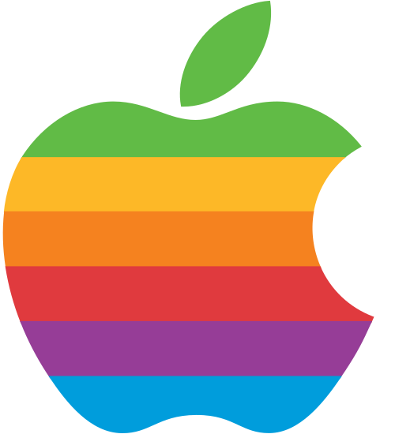

<kbd>Cmd</kbd> <kbd>⌘</kbd>

<kbd>Option</kbd> <kbd>⌥</kbd>
]
.w-third.tc[


<kbd>Ctrl</kbd>

<kbd>Alt</kbd>
]
.w-third.tc[


.f1[`r emo::ji("point_left")`]
]
]

---

# .green[Set Up Your Workspace]

- **Open .code[R/00_general.R]**

- What panes are available?

- Where do you put them?

- Drag to resize

- Pane Layout

- Half Screen

- Full Screen

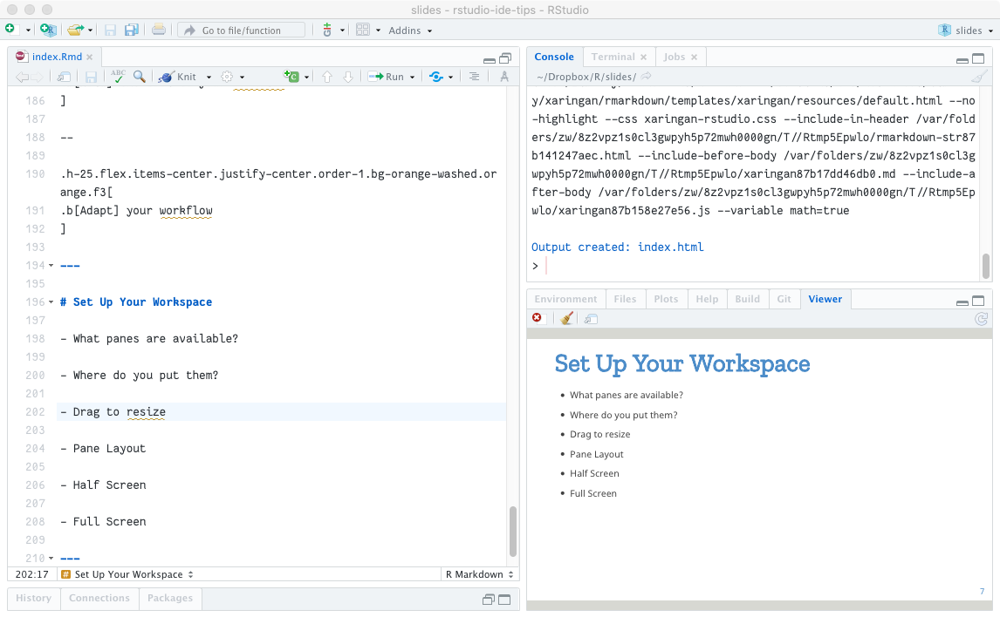

---
class: f3

# Move Between Panes

.flex[
.w-third[
Press <kbd>Ctrl</kbd> + ...
]

.w-third[
<kbd>1</kbd> &rarr; Source

<kbd>2</kbd> &rarr; Console

<kbd>3</kbd> &rarr; Help

<kbd>5</kbd> &rarr; .can-edit[&#8230;]

<kbd>6</kbd> &rarr; .can-edit[&#8230;]

<kbd>7</kbd> &rarr; .can-edit[&#8230;]

<kbd>8</kbd> &rarr; .can-edit[&#8230;]

<kbd>9</kbd> &rarr; .can-edit[&#8230;]
]
]

.absolute.bottom-2[`r emo::ji("vulcan")` **Stretch your fingers**]

---
class: f3

# Zoom To Pane

.flex[
.w-third[
Press <kbd>Ctrl</kbd> + <kbd class="orange">Shift</kbd> + ...
]

.w-third[
.orange[<kbd>1</kbd> &rarr; Source]

.orange[<kbd>2</kbd> &rarr; Console]

<kbd>3</kbd> &rarr; Help

<kbd>5</kbd> &rarr; Files

<kbd>6</kbd> &rarr; Plots

<kbd>7</kbd> &rarr; Packages

<kbd>8</kbd> &rarr; Environment

.orange[<kbd>9</kbd> &rarr; Viewer]
]
]

---
layout: true

# Zoom To Pane

.w-50.fl[
Run this code and then press

<kbd>Ctrl</kbd> + <kbd>Shift</kbd> + <kbd>1</kbd>

```{r eval=FALSE}
library(dplyr)
View(starwars)
```
]

.w-50.fr[
```{r echo=FALSE}
highlight_keys_mac(c("Ctrl", "Shift Left", "1"), "Zoom to Source")
```
```{r echo=FALSE}
highlight_keys_win(c("Ctrl Left", "Shift Left", "1"), "Zoom to Source")
```
]

---

<!-- First Slide -->

---

.w-50.fl[
.blue.zilla.f4[Pipe into View()]

```{r eval=FALSE}
starwars %>% 
  filter(species == "human") %>% 
  View()
```
]

---

.w-50.fl[
.green-dark.zilla.f4[Give your viewer a name]

```{r eval=FALSE}
starwars %>% 
  filter(species == "human") %>% 
  View("humans") #<<
```
]

---
layout: false

# Getting Around

Solve the mystery of the `black_box()` function...

.w-50.fl.tc[
Jump Anywhere

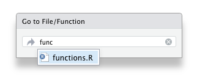
]

.w-50.fl.tc[
Go Back

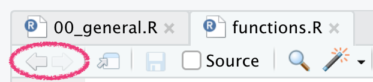
]

.w-50.fl.tc[
Jump to Function

.code[.bg-yellow[black_box]()]

<kbd>F2</kbd>
]

.w-50.fl.tc[
Jump to Help

.code[.bg-yellow[comment](x) <- "..."]

<kbd>F1</kbd>
]

---

# Code Style

- Jump to `code_style.R`

- Use the [styler](https://styler.r-lib.org/) package for magically clean code

- Use `identity()` or `I()` to walk through pipe steps

- Move code up/down to reorganize

- Add new lines and fix indentation: <kbd>Ctrl</kbd> + <kbd>I</kbd>

- Let your code breathe vertically! 
    - Change order of selection in a `select()`
    
    - Use multiple cursors by <kbd>Cmd</kbd> + <kbd>Opt</kbd> + <click></click>

???

I use `Ctrl + Shift + S` for style selection and `Ctrl + Shift + Cmd + S` for style file

---

# Multiple cursors

.mb5[
Click to create new cursors .fr.tr.lh-copy[<kbd>Cmd/Ctrl</kbd> + <kbd>Opt/Alt</kbd> + <click></click>]
]
 
.mb5[ 
Click and drag to select/create new cursors .fr[<kbd>Opt/Alt</kbd> + <click></click> and drag]
]

.mb5[
Create new cursors with the keyboard .fr[<kbd>Cmd/Ctrl</kbd> + <kbd>Opt/Alt</kbd> + <click></click>]
]

.mb5[
Create new cursors from selection .fr[<kbd>Find and Add Next</kbd> <kbd>Find and Select All</kbd>]
]

???

- Find all - `Cmd + Alt + F`

- Find and Add Next - `Cmd + D`

---

# Align Arguments and Assignment

If code is more vertical, alignment is easier.

- Align blocks of similar arguments or names or anytime there's repetition

- Alignment makes it easier to scan for problems

- [AlignAssign](https://github.com/seasmith/AlignAssign)

---

# Addins

[addinslist](https://github.com/daattali/addinslist) — An addin to .b[find] and .b[install] great addins

#### Some Favorites

- [remedy](https://github.com/ThinkR-open/remedy)

- [datapasta](https://github.com/MilesMcBain/datapasta)

- [gistfo](https://github.com/MilesMcBain/gistfo)

- [ermoji](https://github.com/gadenbuie/ermoji)

#### Make Your Own

- [shrtcts](https://pkg.garrickadenbuie/shrtcts)

---

## Coming Soon to an RStudio Near You

New in **RStudio 1.4** along with a few other awesome features

`r emo::ji("star")` Command Palette

`r emo::ji("rainbow")` Rainbow Parens

`r emo::ji("glasses")` Visual Markdown

`r emo::ji("bento")` New Source Column


`r emo::ji("save")` [RStudio Preview](https://rstudio.com/products/rstudio/download/preview/)

---

# .orange[Organize Your Code]

Add .b[section labels] by pressing <kbd>Cmd/Ctrl</kbd> + <kbd>Shift</kbd> + <kbd>R</kbd>

```{r eval=FALSE}
# Library -----------------------------------------------------------------
```

Browse section labels

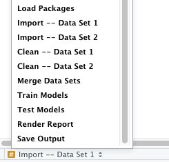

---

# Run Script as Background Job

.flex[
.w-50.tc[
Source as Local Job

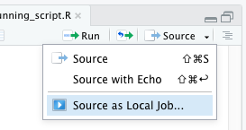
]

.w-50.tc[
Configure Job Settings

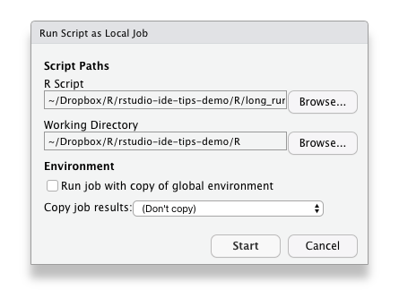
]
]

???

- Default settings
- Return results to environment
- Watch progress in the console
- Use objects from global env

---

# .orange[Let It Go...]

.w-50.tc.pb4.pt2.ph3.fl[
.orange.f4[Restart R Session]

<kbd>Cmd</kbd> + <kbd>Shift</kbd> + <kbd>0</kbd>

<kbd>Ctrl</kbd> + <kbd>Shift</kbd> + <kbd>F10</kbd>
]

.w-50.tc.pb4.pt2.ph3.fl[
.blue.f4[Run Up To Here]

.code.bg-yellow.white.pv1.ph2.mr3[R] <kbd>Cmd/Ctrl</kbd> + <kbd>Opt/Alt</kbd> + <kbd>B</kbd>

.code.bg-pink.white.pv1.ph2.mr3[Rmd] <kbd>Cmd/Ctrl</kbd> + <kbd>Opt/Alt</kbd> + <kbd>P</kbd>
]

.w-50.mh-auto.tc[
.green-dark.f4[Always start with a blank slate]

`usethis::use_blank_slate()`

https://rstats.wtf/save-source.html

`r emo::ji("control_knobs")` Global/Project Settings
]

---

# Use Projects

- [Project-oriented workflow](https://www.tidyverse.org/blog/2017/12/workflow-vs-script/), Jenny Bryan

- [Why should I use the `here` package](https://malco.io/2018/11/05/why-should-i-use-the-here-package-when-i-m-already-using-projects/), Malcom Barrett

- [Use Alfred to launch projects](https://twitter.com/hadleywickham/status/968624630276804608), Hadley Wickham

--

.mt5[
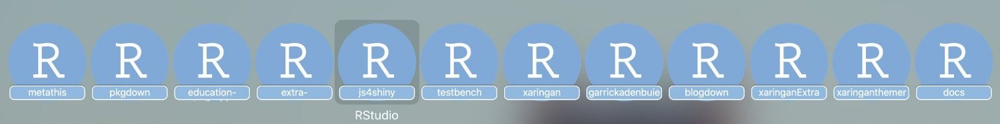
]

---

# Infinite Moon Reader

Automatically renders an R Markdown document whenever you save `r emo::ji("save")`

1. Jump to `docs/try/infinite_moon_reader.Rmd`

1. Edit the document and press save to see it in action

???

- Show extract variable
- Show insert new chunk
- Show insert new chunk within a chunk

---
exclude: true

# Clean Tuition

Jump to `R/clean_tuition.R`

Let's review together, refactoring and restyling the code

Make a function to `tidy_tuition()`, on the way we may learn how to

- Run current function definition
- Use `browser()`
- Insert roxygen skeleton
- Rename in scope

---
class: center middle

# Resources for learning more

.f3[
[RStudio IDE Cheat Sheet](https://github.com/rstudio/cheatsheets/blob/master/rstudio-ide.pdf)

[&commat;rstudiotips](https://twitter.com/rstudiotips)
]

--

.w-100.tc.absolute.bottom-2.left-0[
[&commat;grrrck](https://twitter.com/grrrck) .ph2[&middot;]
[&commat;gvwilson](https://twitter.com/gvwilson)
]

---
class: inverse center middle

# Bonus Round

---

# Snippets

.ba.br2.bw1.b--light-gray.ph1.shadow-3[Global Options] &rarr; Code &rarr; Edit Snippets

--

.b[Snippet Syntax]

```
snippet s3generic
	${1:generic} <- function(x, ...) {
	  UseMethod("${1:generic}", x)
	}

	${1:generic}.${2:method} <- function(x, ...) {
	  ${0}
	}
```

--

.b.blue[Try this one:] `shinymod`

---

# .green-dark[Themes]

#### A collection of many RStudio themes

[garrickadenbuie.com/project/rsthemes/](https://www.garrickadenbuie.com/project/rsthemes/)

#### Install and try themes

```{r eval=FALSE}
remotes::install_github("gadenbuie/rsthemes", dependencies = TRUE)

rsthemes::install_rsthemes()

rsthemes::try_rsthemes()
```

---

# .green-dark[rsthemes addins]

.center[
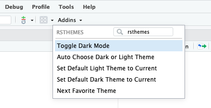

`r emo::ji("sunset")` Toggle Dark Mode

`r emo::ji("night")` Auto Choose Dark or Light Theme

`r emo::ji("red heart")` Next Favorite Theme
]

---

# .green-dark[Assign shortcuts to addins]

.flex[
.w-50[
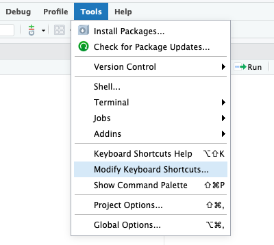
]

.w-50[
.b[Toggle Dark/Light]

<kbd>Ctrl</kbd> + <kbd>Option</kbd> + <kbd>D</kbd>

.b[Next Favorite Theme]

<kbd>Ctrl</kbd> + <kbd>Option</kbd> + <kbd>N</kbd>
]
]


---

# Keyboard Shortcuts

.flex.flex-wrap[
.w-50[
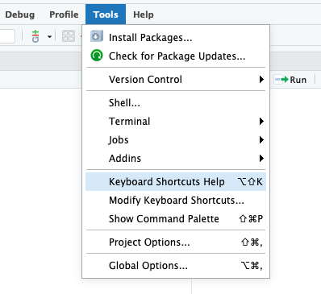
]

.w-50[
#### Reference

- Tools > Keyboard Shortcuts Help

- [RStudio IDE Cheat Sheet](https://raw.githubusercontent.com/rstudio/cheatsheets/master/rstudio-ide.pdf)

.mt5[
#### .green-dark[Your Turn]
]

Take 3 minutes to create new shortcuts for

- Find and Add Next

- Find and Select All
]
]


`r countdown::countdown(3)`

---

# .green-dark[Decorate RStudio]

`r emo::ji("control_knobs")`  There are **many** options to check and adjust in .ba.br2.bw1.b--light-gray.ph1.shadow-3[Global Options]

#### Code > Display

--

.w-50.fl[
#### Appearance

- Fonts
    - Like ligatures? Try [hasklig](https://github.com/i-tu/Hasklig/)
    
- Themes
]

--
    
.fr[
#### Hasklig


#### Source Code Pro

]
